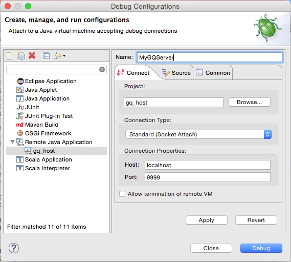

# Preparing Eclipse Scala IDE #

For the build paths there are two variables used, that you need to define, when you check out this repo and use it locally in order to have eclipse find your classes:

	GQ_SERVER_PROJECT_HOME 

points to the home directory of the source code of this play application. This should contain folders such as "app", "target" etc. It might for example look like "myHome/projects/geoquest/server/dev/gq_host"

	PLAY_2_1_2

points to the installation directory of play version 2.1.2 (which we are currently using at time of writing). This can be something like "myHome/bin/play/play-2.1.2" 

Please do not check your personal variable settings file in this git repo since it will work only on your machine.

# Run and Debug Server Locally #

We have a simple bash script that starts the server. You find it in $GQ_SERVER_PROJECT_HOME/scripts. Put its location in your PATH variable to use it independently of your working directory.

	gq_startserver <option>

The options are:

- **run** to start the server in run mode (dynamically compiling new files without restart)
- **debug** to use eclipse debugger with breakpoints etc. (cf. below for details)
- nothing to start the server in start mode

## Local Configuration ##

Set the environment variable $GQ_LOCAL_APP_CONF to point to your local application.con file - which can have any name. Do not put this file under version control. This git only contains server side configuration files.

## Debugging ##

You can debug the server code interactively in eclipse. Tod o so start the server in debug mode, i.e. 

	gq_startserver debug

Then in Eclipse Scala IDE define a Debug Configuration (in context menu on the project) as shown:

Now the server will stop when reaching a breakpoint and eclipse will be brought to the front and switch to debug perspective.